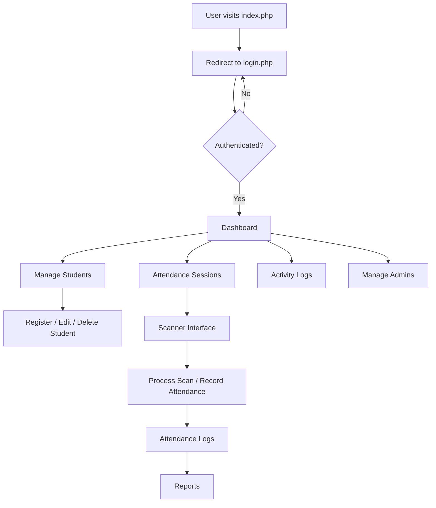

# SECURED RFID VERIFICATION SYSTEM - System Flow

## 1. Project Overview

This system is a PHP/MySQL-based RFID student registration and attendance management application. It supports:

- Admin authentication and session control
- Student registration and management
- RFID-based attendance scanning
- Activity logging and department management
- File upload for student photos

The system is implemented as traditional PHP pages rather than a REST API.

---

## 2. Main Components

### 2.1 Entry Points

- `index.php` → redirects to `login.php`
- `login.php` → admin login form and authentication
- `logout.php` → destroys session and logs out admin

### 2.2 Core Backend

- `config/database.php` → PDO database connection, auto-creates database and tables
- `backend/auth.php` → handles login, session verification, and authentication logic
- `backend/admin/manage_admin_actions.php` → admin CRUD actions
- `backend/admin/student_actions.php` → student CRUD actions

### 2.3 Views and Pages

- `views/dashboard.php` → dashboard overview
- `views/students.php` → student list with search and pagination
- `views/register_student.php` → add new students
- `views/edit_student.php` → update student data
- `views/delete_student.php` → delete student record
- `views/profile.php` → admin profile management
- `views/manage_admins.php` → admin list and management
- `views/manage_departments.php` → department list and management
- `views/activity_logs.php` → activity log history

### 2.4 Attendance Module

- `views/attendance/attendance_sessions.php` → manage attendance sessions
- `views/attendance/start_session.php` → open a session for scanning
- `views/attendance/stop_session.php` → close the scanning session
- `views/attendance/attendance_logs.php` → attendance history
- `views/attendance/attendance_reports.php` → reports view
- `views/attendance/attendance_logs_ajax.php` → AJAX data source for attendance logs
- `scanner/scan.php` → attendance scanner interface
- `scanner/process_scan.php` → scan processing logic

---

## 3. User Flow

### 3.1 System Initialization

1. `index.php` sends the user to `login.php`.
2. `config/database.php` initializes the MySQL database and required tables if they do not exist.
3. A default admin user and default department record are created automatically.

### 3.2 Admin Login Flow

1. Admin opens `login.php`.
2. Credentials are submitted via POST.
3. `backend/auth.php` validates the admin account and saves session values.
4. On success, the admin is redirected to `views/dashboard.php`.
5. On failure, login errors are shown.

### 3.3 Page Access and Layout

1. Most protected pages load `views/layout.php`.
2. `views/layout.php` calls `ensure_user_session()` from `backend/auth.php`.
3. If the admin is not authenticated, inactive, or unauthorized, they are redirected to `login.php`.
4. Non-super-admins are restricted by department using `get_department_filter()`.

### 3.4 Student Management Flow

1. `views/students.php` shows student records with search, pagination, and department scoping.
2. `views/register_student.php` lets admins add a student record with RFID UID and photo upload.
3. `views/edit_student.php` updates student details.
4. `views/delete_student.php` removes a student record.

### 3.5 Attendance Session Flow

1. Admin navigates to `views/attendance/attendance_sessions.php`.
2. Admin can create a new session in `views/attendance/create_session.php`.
3. Sessions are activated with `views/attendance/start_session.php` and stopped with `views/attendance/stop_session.php`.
4. `scanner/scan.php` is used for live RFID scanning during an active session.
5. `scanner/process_scan.php` validates scans, prevents duplicates, logs attendance, and records unknown scans.
6. `views/attendance/attendance_logs.php` and `views/attendance/attendance_reports.php` display results.

### 3.6 Reports and Activity Logging

1. `views/attendance/attendance_logs.php` shows attendance history.
2. `views/attendance/attendance_reports.php` provides summary reports.
3. `views/attendance/attendance_logs_ajax.php` returns filtered attendance data as JSON.
4. `views/activity_logs.php` shows admin operations recorded in `activity_logs`.

---

## 4. Database Structure

### Database Schema

- `admins`
  - `id` INT AUTO_INCREMENT PRIMARY KEY
  - `username` VARCHAR(50) UNIQUE NOT NULL
  - `password` VARCHAR(255) NOT NULL
  - `fullname` VARCHAR(100) NOT NULL
  - `role` ENUM('super_admin','admin') DEFAULT 'admin'
  - `department_id` INT NULL
  - `status` ENUM('active','inactive') DEFAULT 'active'
  - `created_at` TIMESTAMP DEFAULT CURRENT_TIMESTAMP

- `departments`
  - `id` INT AUTO_INCREMENT PRIMARY KEY
  - `department_name` VARCHAR(100) NOT NULL
  - `department_code` VARCHAR(50) UNIQUE NOT NULL
  - `created_at` TIMESTAMP DEFAULT CURRENT_TIMESTAMP

- `students`
  - `id` INT AUTO_INCREMENT PRIMARY KEY
  - `student_id` VARCHAR(20) UNIQUE NOT NULL
  - `first_name` VARCHAR(50) NOT NULL
  - `last_name` VARCHAR(50) NOT NULL
  - `middle_name` VARCHAR(50)
  - `course` VARCHAR(100)
  - `year_level` VARCHAR(10)
  - `section` VARCHAR(20)
  - `contact_number` VARCHAR(15)
  - `email` VARCHAR(100)
  - `address` TEXT
  - `rfid_uid` VARCHAR(50) UNIQUE
  - `photo` VARCHAR(255)
  - `status` ENUM('Active','Inactive') DEFAULT 'Active'
  - `department_id` INT NULL
  - `created_at` TIMESTAMP DEFAULT CURRENT_TIMESTAMP

- `activity_logs`
  - `id` INT AUTO_INCREMENT PRIMARY KEY
  - `admin_id` INT
  - `activity` TEXT
  - `created_at` TIMESTAMP DEFAULT CURRENT_TIMESTAMP

- `attendance_sessions`
  - `id` INT AUTO_INCREMENT PRIMARY KEY
  - `department_id` INT NULL
  - `session_name` VARCHAR(100)
  - `attendance_type` ENUM('IN','OUT')
  - `start_time` TIME
  - `end_time` TIME
  - `status` ENUM('ACTIVE','INACTIVE') DEFAULT 'INACTIVE'
  - `created_at` TIMESTAMP DEFAULT CURRENT_TIMESTAMP

- `attendance_logs`
  - `id` INT AUTO_INCREMENT PRIMARY KEY
  - `student_id` INT
  - `rfid_uid` VARCHAR(50)
  - `attendance_type` ENUM('IN','OUT')
  - `session_id` INT
  - `scan_method` ENUM('RFID','QR')
  - `scan_time` TIMESTAMP DEFAULT CURRENT_TIMESTAMP
  - `created_at` TIMESTAMP DEFAULT CURRENT_TIMESTAMP

- `unknown_scans`
  - `id` INT AUTO_INCREMENT PRIMARY KEY
  - `scanned_value` VARCHAR(255)
  - `scan_method` ENUM('RFID','QR')
  - `created_at` TIMESTAMP DEFAULT CURRENT_TIMESTAMP

### Relationships and Usage

- `admins.department_id` links admin accounts to a `departments` row for scoped access.
- `students.department_id` links students to a department.
- `activity_logs.admin_id` links admin actions to the performing admin.
- `attendance_sessions.department_id` allows sessions to be department-specific or general.
- `attendance_logs.student_id` and `attendance_logs.session_id` connect attendance events to students and sessions.
- `unknown_scans` stores scanned values that do not match any registered student.

---

## 5. System Flow Diagram

---

## 6. Technical Notes

- `config/database.php` uses PDO and automatically creates the database `rfid_system`.
- Passwords are stored hashed using `password_hash()`.
- The application uses server-side validation and prepared statements for security.
- Student photos are saved in `uploads/`.
- The scanner page uses keyboard-based RFID input simulation.

## 7. Recommended File Links

- `index.php` - app entry redirect
- `login.php` - admin authentication page
- `config/database.php` - database connection and schema setup
- `backend/auth.php` - login/session logic
- `views/dashboard.php` - main admin dashboard
- `scanner/scan.php` - scan interface
- `scanner/process_scan.php` - scan processing logic

---

## 8. How to Use This Document

Use this file as a reference for understanding how data moves through the project:

- Start with the login flow in Section 3.2
- Review student and attendance flows in Section 3.4 and 3.5
- Reference the database model in Section 4 for table relationships
- Use the diagram in Section 5 for a quick architecture overview
